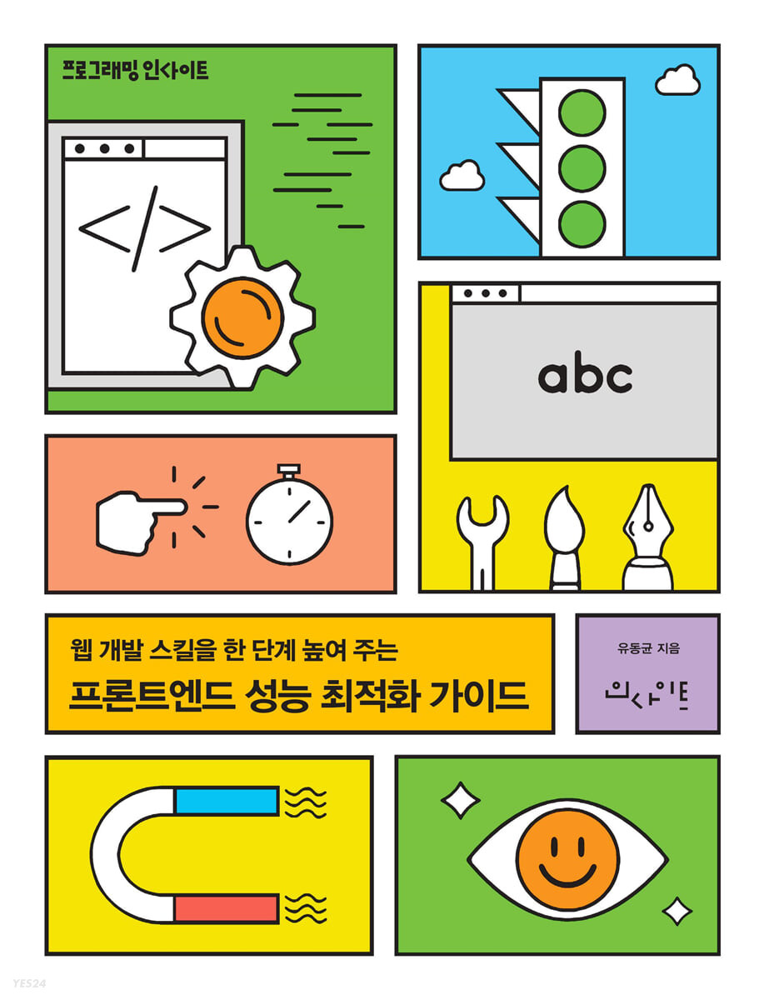
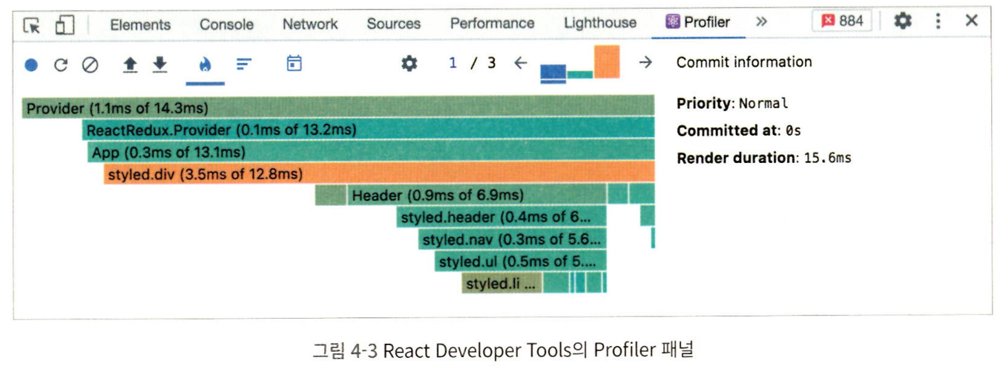
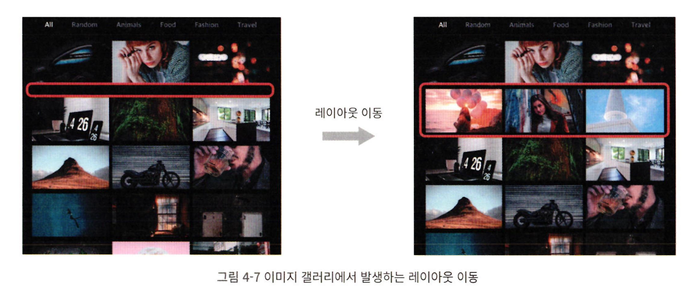
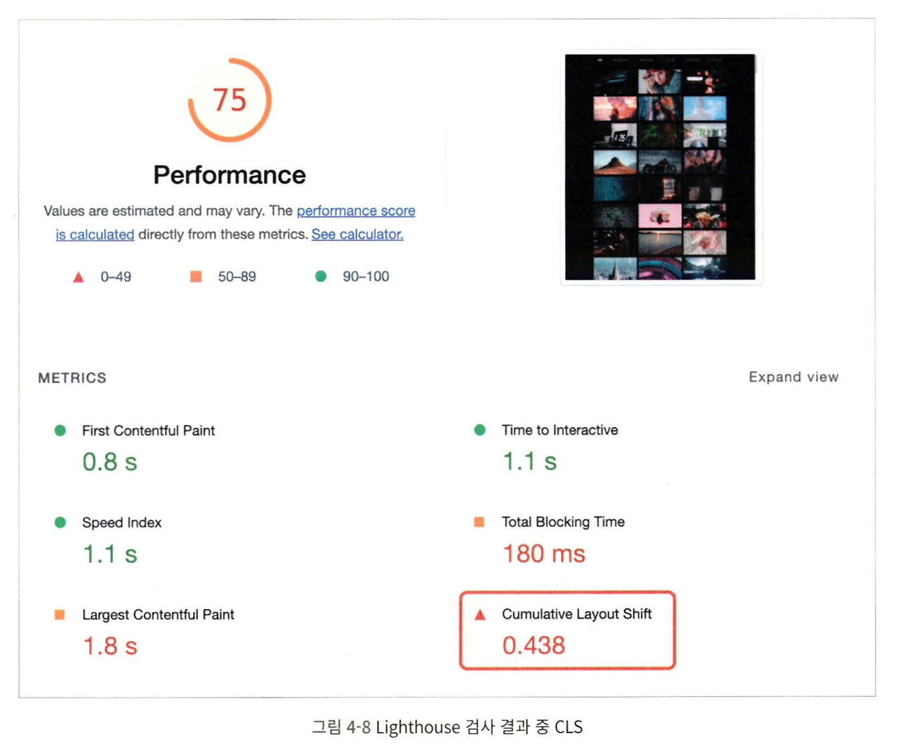
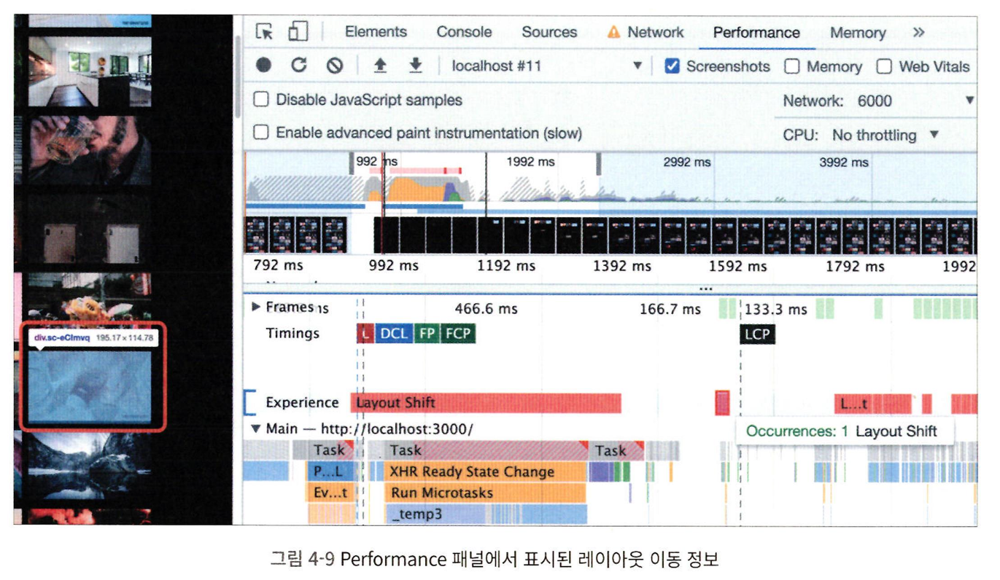
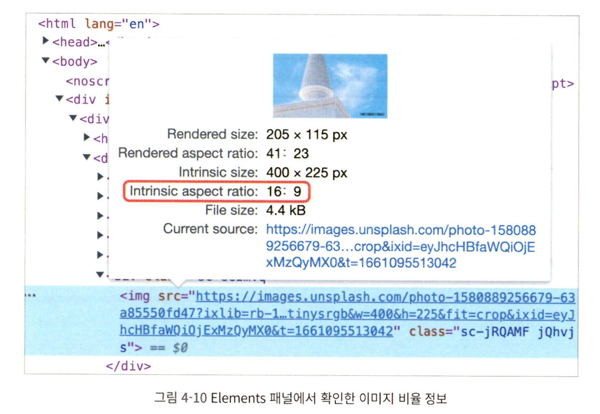
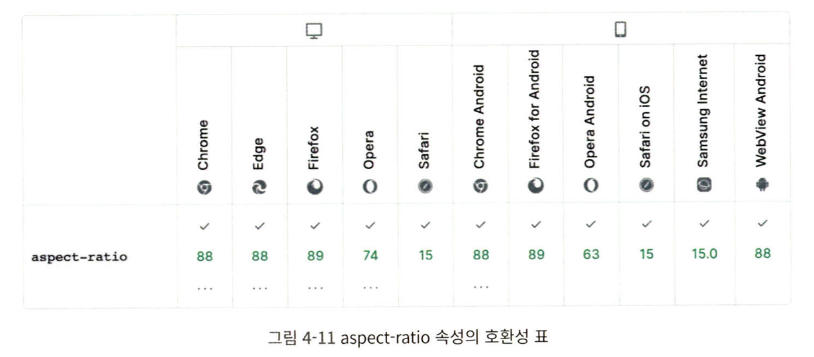

## Lecture-4 : 이미지 갤러리 최적화


프론트엔드 성능 최적화 가이드 책의 part 4 실습 내용입니다.
자세한 스텝은 `커밋 내역`을 참고 바랍니다.

### 실행

1. download sources

```
$ git clone https://github.com/performance-lecture/lecture-1.git
```

2. install dependencies

```
$ npm install
or
$ yarn
```

3. start development server

```
$ npm run start
or
$ yarn start
```

4. start json-server

```
$ npm run server
or
$ yarn server
```

\*3번의 dev server 와 다른 콘솔에서 띄워줍니다.

5. build + serve

```
$ npm run serve
or
$ yarn serve
```

### 실습 내용

- 이미지 지연 로딩
- 레이아웃 이동 피하기
- 리덕스 렌더링 최적화
- 병목 코드 최적화

#### 이미지 지연 로딩

- Intersection Observer API 사용하기
- 외부 라이브러리 사용하기

#### 레이아웃 이동 피하기

- 레이아웃 이동(Layout Shift)
  - 화면상의 요소 변화로 레이아웃이 갑가지 밀리는 현상
  - 특히 이미지의 로딩 과정에서 레이아웃 이동이 많이 발생
  - 사용자 경험에 좋지 않은 영향을 줌

#### 리덕스 렌더링 최적화

- 리덕스(Redux)
  - Recoil, ContextAPI 시대에도 여전히 많이 사용되는 상태관리 라이브러리
  - useSelector 훅

#### 병목 코드 최적화

- 로직 개선
- 메모이제이션

### 분석 툴 소개

#### Chrome Developer Tools

- Network 패널
- Performance 패널
- Lighthouse 패널

#### React Developer Tools

두 가지 패널로 나뉨

- Profiler
- Components

주로 `Profiler`패널 사용

- 얼마만큼의 렌더링이 발생했는지
- 어떤 컴포넌트가 렌더링 되었는지
- 어느 정도의 시간이 소요됐는지
  

### 서비스 탐색

- 이미지가 늦게 뜸
- 이미지가 뜨고 한참 후에야 배경색이 변함

#### 모달이 뜨는 절차

- 사용자는 이미지를 클릭함
- 이미지가 클릭되면 리덕스에 SHOW_MODAL 액션을 보냄
  - modalvisible 값을 true로 변경
- ImageModalContainer에서 modalVisible 값을 구독.
  - src, alt를 ImageModal 컴포넌트에 전달하고 모달을 띄움
- 이미지가 완전히 로드되면 getAverageColorOfImage를 통해 이미지의 평균 색상을 구하고 해당 값을 리덕스에 저장함
- 다시 리덕스 스토어의 상태가 변하고, 최종적으로 변경된 bgColor를 ImageModal에 전달

### 레이아웃 이동 피하기

#### 레이아웃 이동이란?

- 화면상의 요소 변화로 레이아웃이 갑자기 밀리는 현상
- 이미지가 로드될 때 아래 이미지보다 늦게 로드되는 경우, 뒤늦게 아래 이미지를 밀어내면서 화면에 그려짐
  
  Lighthouse에서는 웹 페이지에서 레이아웃 이동이 얼마나 발생하는지에 대한 지표로 CLS(Cumulative Layout Shift)를 제공함
  

CLS는 0부터 1까지의 값을 가짐

- 레이아웃 이동이 전혀 밣생하지 않으면 0, 반대를 1
- 권장 점수는 0.1 이하

Performance 패널을 통해 좀 더 직접적인 원인 파악 가능


##### 레이아웃 이동의 원인

원인은 다양하지만 그 중 가장 흔한 경우들

- 사이즈가 미리 정의되지 않은 이미지 요소
  - 브라우저는 이미지가 다운로드 되기 전까지 크기를 알 수 없음
  - 해당 영역의 크기는 다운로드 전까지 0임
  - 다운로드 되고 나서 밀어냄
- 사이즈가 미리 정의되지 않은 광고 요소
  - 위와 동일
- 동적으로 삽입된 콘텐츠
  - 위와 동일
- 웹 폰트(FOIT, FOUT)
  - 폰트에 따라 글자의 크기가 조금씩 다름
  - 이에 따라 다른 요소의 위치에 영향을 줄 수 있음

해당 서비스의 CLS 원인은 1번임

##### 레이아웃 이동 해결

- 레이아웃 이동을 일으키는 요소의 사이즈를 미리 지정
- 해당 요소의 사이즈를 미리 예측할 수 있거나, 미리 알고 있다면 해당 사이즈 만큼 공간 확보
- 반응형일 경우 이미지 너비, 높이 비율로 공간을 잡아두기
  - 해당 이미지 비율은 16:9

이미지 크기를 비율로 설정하는 두 가지 방법

- padding을 이용하여 박스를 만든 뒤, 그 안에 이미지를 absolute로 띄움
  

  아래같이 하면 wrapper의 너비인 160px의 56.25%만큼 상단 여백(padding-top)이 설정됨

  - 즉 너비는 160px, 높이는 90px이 됨
  - 이 상태에서 이미지를 absoulte로 넣어주면 부모 요소의 div와 사이즈가 동일하게 맞춰짐

1대1 비율로 하고싶으면 padding-top을 100%로 설정함

```html
<div class="wrapper">
  
</div>
<style>
  .wrapper {
    position: relative;
    width: 160px;
    padding-top: 56.25%; /* 16:9 비율 */
  }
  .image {
    position: absolute;
    width: 100%;
    height: 100%;
    top: 0;
    left: 0;
  }
</style>
```

- padding을 이용하여 비율을 맞춰주긴 했지만, padding의 퍼센트를 매번 계산해야 하고 코드가 직관적이지 않음
- `aspect-ratio`라는 CSS 속성을 이용하는 방법
- 자식 요소에 absolute 적용 필요도 없음
- 대신 호환성을 조심해야 함

```css
.wrapper {
  width: 100%;
  aspect-ratio: 16/9;
}
.image {
  width: 100%;
  height: 100%;
}
```

초록색으로 표시된 숫자는 aspect-ratio를 지원하기 시작한 브라우저의 버전을 의미합니다.

