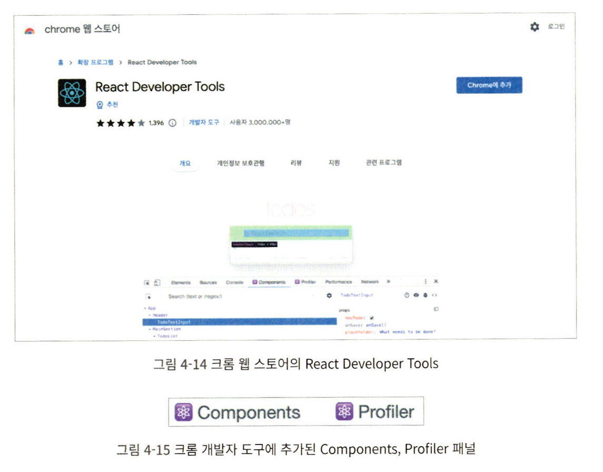
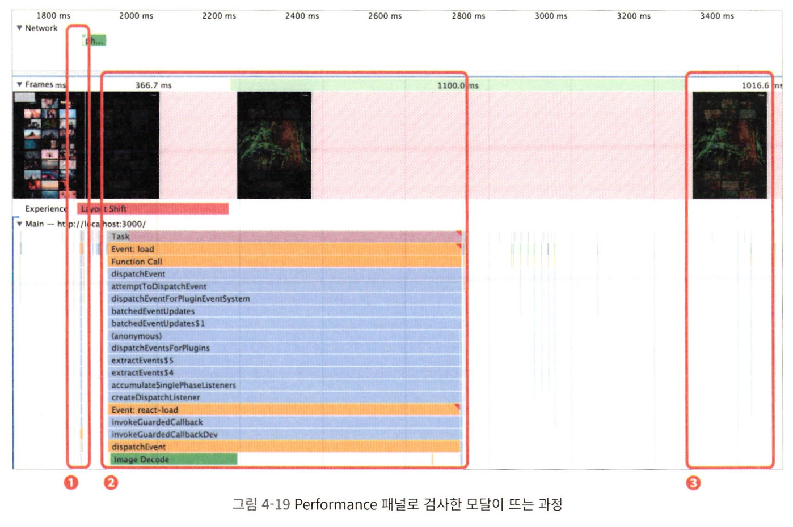
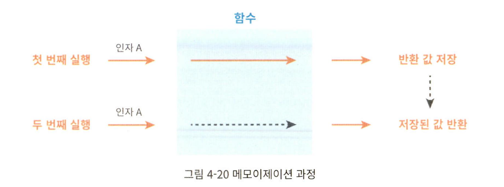
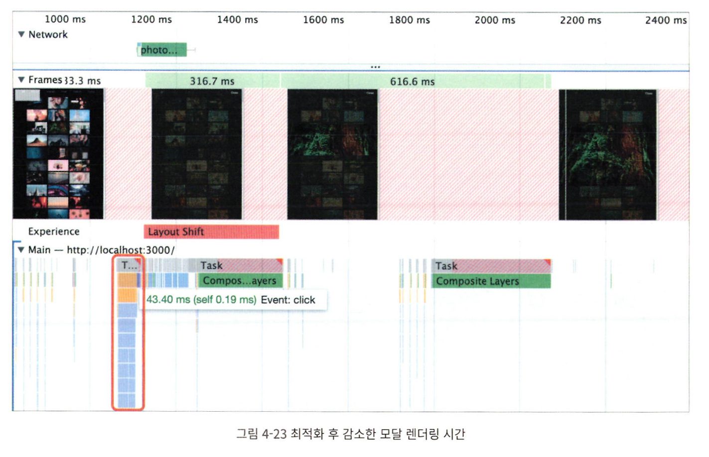

## Lecture-4 : 이미지 갤러리 최적화


프론트엔드 성능 최적화 가이드 책의 part 4 실습 내용입니다.
자세한 스텝은 `커밋 내역`을 참고 바랍니다.

### 실행

1. download sources

```
$ git clone https://github.com/performance-lecture/lecture-1.git
```

2. install dependencies

```
$ npm install
or
$ yarn
```

3. start development server

```
$ npm run start
or
$ yarn start
```

4. start json-server

```
$ npm run server
or
$ yarn server
```

\*3번의 dev server 와 다른 콘솔에서 띄워줍니다.

5. build + serve

```
$ npm run serve
or
$ yarn serve
```

### 실습 내용

- 이미지 지연 로딩
- 레이아웃 이동 피하기
- 리덕스 렌더링 최적화
- 병목 코드 최적화

#### 이미지 지연 로딩

- Intersection Observer API 사용하기
- 외부 라이브러리 사용하기

#### 레이아웃 이동 피하기

- 레이아웃 이동(Layout Shift)
  - 화면상의 요소 변화로 레이아웃이 갑가지 밀리는 현상
  - 특히 이미지의 로딩 과정에서 레이아웃 이동이 많이 발생
  - 사용자 경험에 좋지 않은 영향을 줌

#### 리덕스 렌더링 최적화

- 리덕스(Redux)
  - Recoil, ContextAPI 시대에도 여전히 많이 사용되는 상태관리 라이브러리
  - useSelector 훅

#### 병목 코드 최적화

- 로직 개선
- 메모이제이션

### 분석 툴 소개

#### Chrome Developer Tools

- Network 패널
- Performance 패널
- Lighthouse 패널

#### React Developer Tools

두 가지 패널로 나뉨

- Profiler
- Components

주로 `Profiler`패널 사용

- 얼마만큼의 렌더링이 발생했는지
- 어떤 컴포넌트가 렌더링 되었는지
- 어느 정도의 시간이 소요됐는지
  

### 서비스 탐색

- 이미지가 늦게 뜸
- 이미지가 뜨고 한참 후에야 배경색이 변함

#### 모달이 뜨는 절차

- 사용자는 이미지를 클릭함
- 이미지가 클릭되면 리덕스에 SHOW_MODAL 액션을 보냄
  - modalvisible 값을 true로 변경
- ImageModalContainer에서 modalVisible 값을 구독.
  - src, alt를 ImageModal 컴포넌트에 전달하고 모달을 띄움
- 이미지가 완전히 로드되면 getAverageColorOfImage를 통해 이미지의 평균 색상을 구하고 해당 값을 리덕스에 저장함
- 다시 리덕스 스토어의 상태가 변하고, 최종적으로 변경된 bgColor를 ImageModal에 전달

### 레이아웃 이동 피하기

#### 레이아웃 이동이란?

- 화면상의 요소 변화로 레이아웃이 갑자기 밀리는 현상
- 이미지가 로드될 때 아래 이미지보다 늦게 로드되는 경우, 뒤늦게 아래 이미지를 밀어내면서 화면에 그려짐
  
  Lighthouse에서는 웹 페이지에서 레이아웃 이동이 얼마나 발생하는지에 대한 지표로 CLS(Cumulative Layout Shift)를 제공함
  

CLS는 0부터 1까지의 값을 가짐

- 레이아웃 이동이 전혀 밣생하지 않으면 0, 반대를 1
- 권장 점수는 0.1 이하

Performance 패널을 통해 좀 더 직접적인 원인 파악 가능


##### 레이아웃 이동의 원인

원인은 다양하지만 그 중 가장 흔한 경우들

- 사이즈가 미리 정의되지 않은 이미지 요소
  - 브라우저는 이미지가 다운로드 되기 전까지 크기를 알 수 없음
  - 해당 영역의 크기는 다운로드 전까지 0임
  - 다운로드 되고 나서 밀어냄
- 사이즈가 미리 정의되지 않은 광고 요소
  - 위와 동일
- 동적으로 삽입된 콘텐츠
  - 위와 동일
- 웹 폰트(FOIT, FOUT)
  - 폰트에 따라 글자의 크기가 조금씩 다름
  - 이에 따라 다른 요소의 위치에 영향을 줄 수 있음

해당 서비스의 CLS 원인은 1번임

##### 레이아웃 이동 해결

- 레이아웃 이동을 일으키는 요소의 사이즈를 미리 지정
- 해당 요소의 사이즈를 미리 예측할 수 있거나, 미리 알고 있다면 해당 사이즈 만큼 공간 확보
- 반응형일 경우 이미지 너비, 높이 비율로 공간을 잡아두기
  - 해당 이미지 비율은 16:9

이미지 크기를 비율로 설정하는 두 가지 방법

- padding을 이용하여 박스를 만든 뒤, 그 안에 이미지를 absolute로 띄움
  

  아래같이 하면 wrapper의 너비인 160px의 56.25%만큼 상단 여백(padding-top)이 설정됨

  - 즉 너비는 160px, 높이는 90px이 됨
  - 이 상태에서 이미지를 absoulte로 넣어주면 부모 요소의 div와 사이즈가 동일하게 맞춰짐

1대1 비율로 하고싶으면 padding-top을 100%로 설정함

```html
<div class="wrapper">
  
</div>
<style>
  .wrapper {
    position: relative;
    width: 160px;
    padding-top: 56.25%; /* 16:9 비율 */
  }
  .image {
    position: absolute;
    width: 100%;
    height: 100%;
    top: 0;
    left: 0;
  }
</style>
```

- padding을 이용하여 비율을 맞춰주긴 했지만, padding의 퍼센트를 매번 계산해야 하고 코드가 직관적이지 않음
- `aspect-ratio`라는 CSS 속성을 이용하는 방법
- 자식 요소에 absolute 적용 필요도 없음
- 대신 호환성을 조심해야 함

```css
.wrapper {
  width: 100%;
  aspect-ratio: 16/9;
}
.image {
  width: 100%;
  height: 100%;
}
```

초록색으로 표시된 숫자는 aspect-ratio를 지원하기 시작한 브라우저의 버전을 의미합니다.


### 이미지 지연 로딩

react-lazyload 라이브러리 사용

```bash
npm install --save react-lazyload
```

- 지연 로드하고자 하는 컴포넌트를 감싸주기만 하면 됨
- 해당 컴포넌트의 자식 요소들은 화면에 표시되기 전까지 렌더링 되지 않음
  - 이미지 뿐만 아니라 일반 컴포넌트 포함
- 이미지가 크면 뷰포트에 들어와도 로딩하는데 오래걸림
  - offset을 이용하여 미리 당겨올 수 있음

### 리덕스 렌더링 최적화

#### 리액트의 렌더링

리액트는 렌더링 사이클을 갖습니다

- 서비스의 상태가 변경되면 화면에 반영하기 위해 리렌더링 과정을 거칩니다.
- 리렌더링은 메인스레드의 리소스를 차지하여 성능에 영향을 줍니다.
- 성능에 영향을 주는 요소
  - 렌더링 시간이 오래 걸리는 컴포넌트
    - 오래걸리는 로직 존재
  - 불필요한 렌더링

#### React Developer Tools



- 이미지를 클릭해서 이미지 모달을 띄었는데, 모달 뿐만 아니라 헤더와 이미지 리스트 컴포넌트도 리렌더링 됨
  - 모달을 띄우는 순간
  - 모달의 이미지가 로드된 후 배경 색이 바뀌는 순간
  - 모달을 닫는 순간

##### 리렌더링의 원인

###### 리덕스

리덕스 안에 많은 상태들이 있음

- useSelector를 이용하여 필요한 상태만 구독

  - 새로운 객체를 만들어 리턴하면 새로운 참조 값을 반환하는 형태이므로 구독한 값이 변했다 판단

###### 객체를 새로 만들지 않도록 반환 값 나누기

각 값을 개별적으로 읽어오는 useSelector

```js
const modalVisible = useSelector(state => state.imageModal.modalVisible);
const bgColor = useSelector(state => state.imageModal.bqColor);
const src = useSelector(state => state.imageModal.src);
const alt = useSelector(state => state.imageModal.alt);
```

H e a d e r 의 u s e S e l e c t o r 에 서 반 환 형태 수 정

```js
const category = useSelector(state => state.category.category);
```

###### Equality Function 사용

useSelector의 옵션으로 넣는 함수
리덕스 상태가 변했을 때, 이전 값과 비교할 수 있도록 해주는 함수

**- 주의 : filter 같이 새 객체([]) 만드는 파생 상태의 경우, 상태 밖에서 수행**

### 병목 코드 최적화

문제가 될 수 있는 부분

- 페이지가 최초로 로드될 떄
  - pass
- 카테고리를 변경했을 때(라우팅)
  - pass
- 이미지 모달을 띄웠을 때
  - 이미지도 늦게 뜸
    - 이미지 사이즈 때문에 어쩔 수 없음
  - 배경색도 늦게 변함
    **- _해당 부분은 살펴볼 필요가 있음_**

모달이 뜨는 과정에서 메인 스레드의 작업 확인하기

- 화면이 완전히 로드된 상태로 Performace 패널의 새로고침 버튼이 아닌 기록 버튼 클릭
- 그리고 이미지를 클릭하여 모달을 띄운 뒤 기록 버튼을 다시 누르면 기록이 종료됨
- 필요애 따라 네트워크 및 CPU에 throttling 옵션 설정
  

1. 1번에서 이미지 클릭으로 인해 모달이 뜸
   - 모달 안에서 이미지를 다운로드
   - 이미지 다운로드 완료되면 2번으로 넘어감
2. 식별 가능한 함수명이 보이지 않음
   - 하지만 우리는 이미 getAverageColorOfImage 함수가 호출됨을 알고 있음
   - 마지막에 Image Decode가 보임
     - 캔버스.drawImage의 하위 작업
3. 2번 작업 끝나고 3번과 같이 새롭게 렌더링 되면서 변경된 배경화면이 화면에 보임

#### getAverageColorOfImage 함수 분석

- 이 함수는 이미지의 평균 픽셀 값을 계산하는 함수
  - 캔버스에 이미지를 올림
  - 픽셀 정보를 불러옴
  - 모든 픽셀을 순회하며 하나씩 더해서 평균냄
- 반복문으로 모든 픽셀을 더하고, 이미지를 캔버스에 통째로 올려서 느림

두 가지 방법으로 최적화를 시도해 볼 수 있음

- 메모이제이션
- 로직 개선

##### 메모이제이션으로 코드 최적화하기

- 동일인자가 들어오면 이전에 계산한 값을 재활용
  

예제 : 인자 제곱 함수

```js
const cache = {}; // 함수의반환값을저장하기위한변수
function square(n) {
  // 이미저장된값이라면기존값을그대로반환
  return cache[n] || (cache[n] = n * n);
}
```

getAverageColorOflmage

```js
const cache = {};
export function getAverageColor0fImage(imgElement) {
  if (cache.hasOwnProperty(imgElement.src)) {
    return cache[imgElement.src];
  }
  /* 중략 */
  return (cache[imgElement.src] = averageColor);
}
```

메모이제이션 적용 시 처음엔 느린데 이후에는 빠름
(동일한 이미지 적용 시)

하지만 첫번째 실행에선 여전히 느림
매번 새로운 인자가 들어오는 함수에서는 메모리만 잡아먹는 골칫거리임

##### 함수의 로직 개선

1. 일단 이미지를 작은 사이즈로 교체
   - 섬네일 이미지로 계산하면 어떨까
     - 작업량 감소
     - 이미지가 다운로드 되기 전에 계산 가능

이미지 뜨기 전에 계산 완료된 것을 볼 수 있음